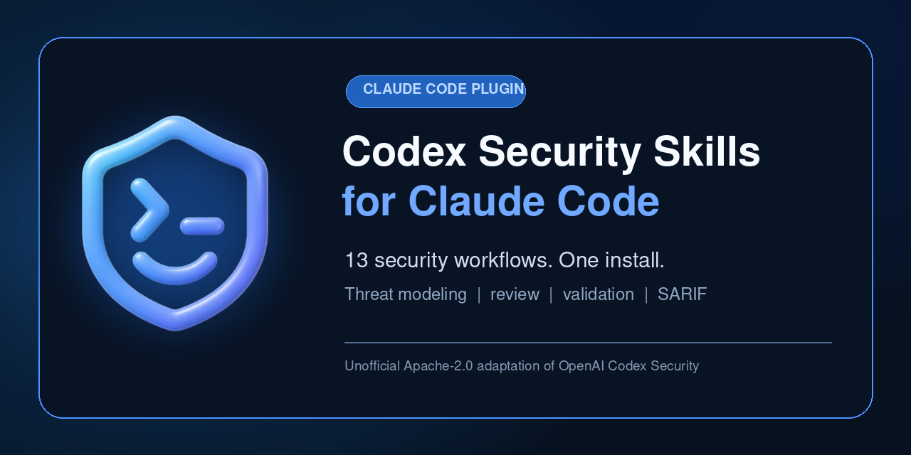

# Codex Security Skills for Claude Code

<p align="center">
  
</p>

<p align="center">
  <a href="https://github.com/barvhaim/codex-security-claude-marketplace/actions/workflows/ci.yml"></a>
  <a href="https://github.com/barvhaim/codex-security-claude-marketplace/releases"></a>
  <a href="LICENSE"></a>
  
</p>

Run thirteen open-source security workflows from OpenAI Codex Security inside Claude Code: repository review, diff review, threat modeling, finding validation, attack-path analysis, remediation, tracking, and SARIF-ready reporting.

> [!IMPORTANT]
> This is an unofficial Apache-2.0 adaptation. It is not affiliated with or endorsed by OpenAI or Anthropic, and it does not install the Codex Security product or SDK.

## Install

Open Claude Code and run:

```text
/plugin marketplace add barvhaim/codex-security-claude-marketplace
/plugin install codex-security-skills@njs-security-skills
/reload-plugins
```

Then review the current branch, PR, commit, staged changes, or working tree:

```text
/codex-security-skills:security-diff-scan Review the current working tree for security regressions. Do not modify files.
```

Or scan the whole repository:

```text
/codex-security-skills:security-scan Scan this repository. Do not modify source files.
```

Scan artifacts are written outside the target repository under `~/.claude/security-scans/` unless you choose another output directory.

## Pick the right workflow

| Goal | Command |
| --- | --- |
| Review a PR, commit, branch, patch, staged changes, or working tree | `/codex-security-skills:security-diff-scan` |
| Run the default single-pass repository audit | `/codex-security-skills:security-scan` |
| Run repeated independent discovery passes for higher recall | `/codex-security-skills:deep-security-scan` |
| Map assets, trust boundaries, entry points, and abuse cases | `/codex-security-skills:threat-model` |
| Investigate a candidate vulnerability | `/codex-security-skills:finding-discovery` |
| Reproduce or disprove a candidate finding | `/codex-security-skills:validation` |
| Connect validated findings into attacker journeys | `/codex-security-skills:attack-path-analysis` |
| Draft a vulnerability report | `/codex-security-skills:vulnerability-writeup` |
| Implement and verify a narrow fix | `/codex-security-skills:fix-finding` |
| Propose hardening without editing source | `/codex-security-skills:propose-security-hardening` |
| Triage a ticket, advisory, or report | `/codex-security-skills:triage-finding` |
| Synchronize validated findings with trackers | `/codex-security-skills:track-findings` |
| Define a repository security policy | `/codex-security-skills:define-security-policy` |

## What the plugin produces

The scan workflows preserve the upstream artifact contract:

- `scan-manifest.json` for target identity, scope, status, and artifact hashes.
- `findings.json` for structured findings, evidence, confidence, severity, and remediation.
- `coverage.json` for reviewed surfaces, exclusions, and deferred work.
- `report.md` as a deterministic human-readable projection.
- `exports/results.sarif` for compatible code-scanning tools.

A bundled static fixture demonstrates the final output without model credentials:

| Result | Value |
| --- | --- |
| Finding | Unsafe archive extraction can escape the output directory |
| Severity | High, CVSS 8.1 |
| Confidence | High |
| Taxonomy | CWE-22, path traversal |
| Coverage | Complete |

View the generated [example report](plugins/codex-security-skills/examples/completed-scan/report.md) and [SARIF export](plugins/codex-security-skills/examples/completed-scan/exports/results.sarif). The example proves deterministic artifact generation, not model accuracy.

## Why one plugin

The skills share references, schemas, artifact contracts, and Python helpers. Packaging them together preserves relative links and installs one coherent workflow instead of thirteen incomplete fragments. Claude Code discovers each skill independently under the `codex-security-skills` namespace.

## Local development

Add a local checkout as a marketplace:

```text
/plugin marketplace add /absolute/path/to/codex-security-claude-marketplace
/plugin install codex-security-skills@njs-security-skills
/reload-plugins
```

Or load only the plugin during development:

```bash
claude --plugin-dir ./plugins/codex-security-skills
```

## Verify the port

```bash
python3 -m unittest discover -s tests -v
python3 scripts/check_portability.py
python3 scripts/smoke_finalize.py
python3 scripts/smoke_plugin_load.py
claude plugin validate .
claude plugin validate ./plugins/codex-security-skills
```

The verification ladder distinguishes between manifest validation, plugin discovery, isolated installation, deterministic helper execution, and authenticated model behavior. See [`ADAPTATION.md`](plugins/codex-security-skills/ADAPTATION.md) for the exact boundary.

## Repository structure

```text
.claude-plugin/marketplace.json
plugins/codex-security-skills/
├── .claude-plugin/plugin.json
├── skills/
├── references/
├── scripts/
├── schemas/
├── examples/
├── ADAPTATION.md
├── THIRD_PARTY_NOTICES.md
└── UPSTREAM_SOURCE.json
```

## Compatibility and limitations

Installing this plugin does not install Codex Security authentication, desktop setup, SDK event streaming, or its durable MCP coordinator. The rewritten top-level workflows use Claude Code tools and subagents when available. Deep scans fall back to sequential independent passes when subagents are unavailable.

Linear and Jira tracking require separately configured Claude Code MCP or tool integrations with identity, search, mutation, and exact-readback capabilities. GitHub tracking can use an explicitly selected authenticated `gh` identity.

Schema-valid output does not prove that a model-generated finding is correct or that every vulnerability was found. Review findings before making consequential security decisions.

## Contributing and security

Read [`CONTRIBUTING.md`](CONTRIBUTING.md) before changing upstream-derived files. Report vulnerabilities according to [`SECURITY.md`](SECURITY.md).

## Upstream and license

- Original project: [openai/codex-security](https://github.com/openai/codex-security)
- Pinned source revision: `f22d4a36f26d16287bcdfd707b369116e02a08c3`
- Original copyright: Copyright 2025 OpenAI
- License: Apache License 2.0

See [`LICENSE`](LICENSE), [`THIRD_PARTY_NOTICES.md`](plugins/codex-security-skills/THIRD_PARTY_NOTICES.md), and [`UPSTREAM_SOURCE.json`](plugins/codex-security-skills/UPSTREAM_SOURCE.json).
